# AfterCrash — Technical Architecture (judge-lens edition)

> "हादसे के बाद, आपका हक़" — *After the crash, what your family is owed.*
> Budget: **₹0, no credit card.** Deadline: Mon 5 Oct 14:00 IST.

## 0. Design principle the judges will notice
**LLMs handle language. Code handles law and money. Humans approve actions.**
Anthropic's *Building Effective Agents* and the Beeck Center rules-as-code study both say the same thing: use a **predictable workflow** wherever the path is known, and keep the open-ended agent loop **bounded** to where judgement is actually needed. Every rupee and every date in AfterCrash comes from deterministic, cited, tested code. The LLM never computes money.

## 1. Rubric → technical choice map
| Rubric (pts) | What we ship |
|---|---|
| Strength of core solution (24) | End-to-end: documents → facts → entitlements → deadline plan → drafted letters → print packet, reminders, WhatsApp share |
| Technical depth & reliability (24) | Rules-as-code engine with citations · zod-typed agent contracts · **property-based tests** (fast-check) · **golden-case eval harness** shown live in-app · multi-provider router with fallback · input-hash cache · **no-AI mode** so it never breaks |
| Originality (15) | Hidden-cover discovery from the family's own papers · **value-of-information questioning** · **what-if simulator tool** · **zero-database case handoff via URL fragment/QR** · evidence highlighting on the document · prompt-injection red-team case |
| Real-world usability (12) | 3-step flow, mobile-first, Hindi/English, voice in, read-aloud out, confirmation screens, printable claim packet |
| Responsible design (10) | On-device OCR · on-device PII shield (Aadhaar **Verhoeff**-validated) · only anonymised text leaves the device · no-training LLM provider · prompt-injection classifier · verifier blocks bad drafts · human approval gate · citations + "last verified" dates · three honest buckets · NALSA 15100 handoff |
| User insight (15) | Survey + interviews, and an in-app "Why this exists" page with cited evidence |

## 2. Stack (all free)
| Layer | Choice |
|---|---|
| App | **Next.js (App Router) + TypeScript + Tailwind**, deployed on **Vercel Hobby** |
| GenAI SDK | **Vercel AI SDK** (`ai`) — `generateObject` with **zod** schemas, tool calling with `maxSteps` |
| LLM providers | **Groq free** `openai/gpt-oss-120b` → `openai/gpt-oss-20b` → `qwen/*` → **Gemini free** (anonymised text only) → no-AI mode |
| Safety model | **Llama Prompt Guard** (on Groq free tier) scans OCR text for injected instructions |
| OCR | **Tesseract.js** (eng + hin) in a Web Worker; **pdf.js** for digital PDFs (exact text, no OCR) |
| Parsing | Deterministic parsers: passbook (PMSBY ₹20 / PMJJBY ₹436 debits, last card/UPI txn), motor policy (CPA ₹15 L, period, owner, reg. no.), FIR (date, PS, BNS sections, "अज्ञात वाहन / unknown vehicle") |
| Privacy | PII Shield: Aadhaar (Verhoeff checksum), PAN, phone, account no., IFSC, email, user-supplied names → reversible tokens kept in the browser |
| Outputs | Print-CSS claim packet (correct Devanagari shaping, Save-as-PDF), `.ics` deadlines, Google Calendar links, WhatsApp `wa.me` share, **QR** (`qrcode`) of an `lz-string`-compressed case in the URL **fragment** (never sent to any server) |
| Voice | Web Speech API (hi-IN / en-IN) in; SpeechSynthesis read-aloud out |
| Tests | **Vitest** + **fast-check** property tests + golden-case evals |
| Ops | GitHub Actions (free) running tests; optional "policy watcher" cron that opens an issue when PIB news mentions a covered scheme |

## 3. The agent workflow

```mermaid
flowchart LR
  A[Intake: story, voice, 6 key questions] --> B[Reader: pdf.js / Tesseract on device]
  B --> C[Parsers: passbook, policy, FIR - deterministic]
  B --> S[PII Shield on device: tokenise names, Aadhaar, PAN, phone, accounts]
  S --> G[Guard: Prompt Guard injection check]
  G --> X[Extractor LLM: narrative -> typed facts + evidence quotes]
  C --> M[Fact merge: provenance + confidence]
  X --> M
  M --> H{Human confirms facts}
  H --> Q[Questioner: value-of-information - ask what unlocks the most rupees/urgency]
  Q --> R[Rules Engine: entitlements, amounts, deadlines, exclusions, citations]
  R --> P[Planner: dependency DAG + earliest-deadline-first + document dedupe]
  P --> D[Drafter LLM: letters with placeholders]
  D --> V[Verifier: every amount/date/name in draft must match facts + rules]
  V --> Y{Human approves each letter}
  Y --> O[Outputs: print packet, .ics, WhatsApp, QR handoff]
  R -.what-if.-> K[Case Agent chat: tools = simulateWhatIf, explainRule]
```

Agents are typed functions with **zod input/output contracts**, a **token budget**, and a trace record (model, tokens, latency, fallback used). The UI shows the trace live, so judges can watch the orchestration.

## 4. Feature list (X-factors) — build order
**Must-ship (core)**
1. Rules-as-code engine — 9 entitlements, each with conditions, amount, deadline, documents, office, exclusions, citation URL, `lastVerified`.
2. Three honest buckets: **Confirmed from documents / Possible — verify / Not eligible (reason)**.
3. On-device document reading + deterministic parsers + **evidence highlighting** (click a fact → see the box on the document).
4. PII Shield with Verhoeff-validated Aadhaar masking; only anonymised text leaves the device.
5. LLM extractor with zod schema + provider router + cache + no-AI mode.
6. Value-of-information questioner (rank unknown facts by rupees unlocked × deadline urgency).
7. Planner: DAG + earliest-deadline-first + "get N attested copies of FIR" dedupe.
8. Drafter + **Verifier** + per-letter approval → print packet, `.ics`, WhatsApp.
9. Live agent trace panel (steps, model, tokens, ₹0 cost, fallbacks).
10. Synthetic sample cases (3) including a **prompt-injection red-team FIR**.
11. Golden-case evals + property tests, with an in-app **Evals** page showing pass rate.

**Stretch (if time)**
12. Case Agent chat with `simulateWhatIf` / `explainRule` tools ("What if the truck is found?").
13. Claim Graph visualisation (documents → facts → entitlements → tasks).
14. QR / URL-fragment case handoff for caseworkers.
15. Hindi read-aloud of the plan; voice intake.
16. PWA offline mode (rules + OCR cached).
17. GitHub Actions policy watcher.

**Pitch-only (roadmap)**: DigiLocker requester API, Account Aggregator consent flow, eDAR victim access, WhatsApp bot, state-specific schemes, caseworker dashboard for DLSA/PLVs.

## 5. Entitlements in the MVP rules engine
| ID | Entitlement | Amount (death) | Key conditions | Deadline logic |
|---|---|---|---|---|
| HIT_RUN | Hit-and-Run Compensation Scheme 2022 (MV Act s.161) | ₹2,00,000 (grievous hurt ₹50,000) | Offending vehicle untraced | No limitation; CEO report 30 d → sanction 15 d → pay 15 d; refundable if vehicle traced and MACT pays |
| CPA | Compulsory PA cover, owner-driver (IRDAI) | ₹15,00,000 | Victim = registered owner + driving own insured vehicle + policy active + valid DL + CPA not opted out | Intimate insurer ASAP (policy wording) |
| PMSBY | PM Suraksha Bima Yojana | ₹2,00,000 | Enrolled, ₹20 premium debited for current cover year, age 18–70 | Claim preferably within 30 days |
| PMJJBY | PM Jeevan Jyoti Bima Yojana | ₹2,00,000 | Enrolled, ₹436 premium debited; any cause of death | Claim to bank promptly |
| RUPAY | PMJDY RuPay card accident cover | ₹2,00,000 (₹1 L if account opened ≤ 28-08-2018) | RuPay PMJDY card + a card transaction within 90 days before the accident | Intimate within 90 days; documents within 60 days of intimation |
| MACT | MACT claim: no-fault s.164 + fault-based s.166 | ₹5,00,000 no-fault (more via s.166) | Vehicle identified + insured | 6 months (s.166(3)); SC interim order: not to be dismissed as time-barred |
| RAHAT | PM RAHAT cashless treatment | Up to ₹1,50,000 treatment, 7 days | Admitted within 24 h at a designated hospital | Within 7 days of the accident |
| EMPLOYER | ESIC dependants' benefit / Employees' Compensation (commuting) | Varies | Employed + on duty/commuting; ESIC and EC Act mutually exclusive | Verify with employer |
| GIG | Gig-platform accident cover | Varies (e.g., up to ₹10 L) | Victim was on-trip / logged in | Report in partner app ASAP |
Always: free legal aid via **DLSA / NALSA 15100**.
